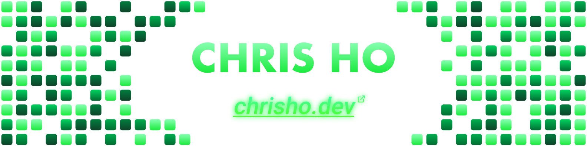

### Hi I'm Chris! 
- 👋 I'm a CS student interested in software development
- 🌱 I’m currently learning about data structures and algorithms
- ⚡ Fun Fact: I like 3D modeling

## Projects

| Project  | Description | Progress Bar |
| ------------- |-------------|-----:|
| [Beaver Eats](https://github.com/PotatoPresident/Beaver-Eats)  | Crowdsourced review website for places to eat on the Oregon State University campus.  |  🟩🟩🟩🟩🟩🟩🟩🟩🟩🟩  100% |
| [SMS Food Text](https://github.com/chostudio/food-sms-text)  | Sends a user a scheduled SMS text of Oregon State University's dining hall menus and hours of operations. | 🟩🟩🟩🟩🟩🟩🟩🟩🟩🟩  100%  |
| [Laugh Lab](https://github.com/laughlab/LaughLab)  | A responsive frontend website for a hand sanitizer company. | 🟩🟩🟩🟩🟩🟩🟩🟩🟩🟩  100%  |
| [Patent Searcher GUI](https://github.com/chostudio/patentSearcherGUI)  | A custom desktop patent searcher that uses the USPTO API. | 🟩🟩🟩🟩🟩🟩🟩🟩🟩🟩  100%  |
| [Slingshot](https://github.com/chostudio/Slingshot)  | 2D hypercasual physics-based mobile game made with Unity. | 🟩🟩🟩🟩🟩🟩🟩🟩🟩🟩  100%  |
| [AudioToText](https://github.com/chostudio/AudioToText)  | Website that generates the text transcript for a podcast given a link or an mp3 audio file. | 🟩🟩🟩🟩⬜️⬜️⬜️⬜️⬜️⬜️  40%  |
| [PremierBites](https://github.com/chostudio/premierbites)  | AI Chatbot that suggests healthy food ingredient alternatives | 🟩🟩⬜⬜️⬜️⬜⬜️⬜️⬜⬜️  20%  |
| ???  | More projects to come soon! :) | ⬜️⬜️⬜️⬜️⬜️⬜️⬜️⬜️⬜️⬜️  ?%  |

<!-- |   | description | 🟩🟩🟩🟩🟩🟩🟩🟩🟩🟩  100%  | -->

 

## Languages:

## Technologies/Frameworks:

## Tools:

## Design + Misc:

### Connect with my Linkedin:

 
 
 

### Portfolio Website:
#### [https://chrisho.dev](https://chrisho.dev)

### My Resume:
#### [https://chrisho.dev/Chris_Ho_Resume.pdf](https://chrisho.dev/Chris_Ho_Resume.pdf)

<!--
Add Resume Link Button & send to online host copy no need download

Add portfolio Link button

Here are some ideas to get you started:

- 🔭 I’m currently working on ...
- 🌱 I’m currently learning ...
- 👯 I’m looking to collaborate on ...
- 🤔 I’m looking for help with ...
- 💬 Ask me about ...
- 📫 How to reach me: ...
- 😄 Pronouns: ...
- ⚡ Fun fact: ...
-->
